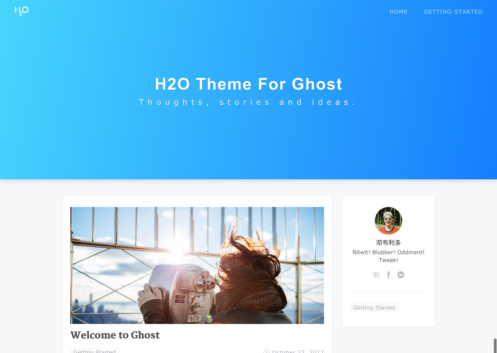

# ghost-theme-H2O

这是jekyll主题H2O的Ghost移植版，[原版项目](https://github.com/kaeyleo/jekyll-theme-H2O)。
ghost compatible H2O theme, fork from [kaeyleo/jekyll-theme-H2O](https://github.com/kaeyleo/jekyll-theme-H2O).

此移植版本基于jekyll-theme-H2O comment 46066af。
This version is based on the comment 46066af of jekyll-theme-H2O。

### Documents

#### [查看新手入门与使用文档 Guides and Documents → ](DOCUMENTS.md)

### Preview

#### [原版在线预览 Live Demo of Jekyll Version → ](http://liaokeyu.com/)




如果你喜欢这个博客模板，请在右上角star一下，非常感谢～

If you like this theme or using it, please give a ⭐️ for motivation ;)

### Features and Progress 特性以及移植进度

#### CN

- [x] 代码高亮
- [x] 夜间模式
- [x] Disqus评论系统
- [x] 粉蓝两种主题色
- [x] 头图个性化底纹
- [x] 响应式设计
- [x] 社交图标
- [x] SEO标题优化
- [x] 文章标签索引
- [ ] 博客文章搜索
- [x] 复制文章内容自动添加版权

#### EN

- [x] Code highlight
- [x] Night mode
- [x] Disqus Comment System
- [x] Theme color: Blue & Pink
- [x] Hero Patterns
- [x] Responsive design
- [x] SNS Icon
- [x] Title SEO
- [x] Tags system
- [ ] Search
- [x] Copyright text on copy event

### Contribution 贡献

Any types of contribution are welcome. Thanks.

接受各种形式的贡献，包括不限于提交问题与需求，修复代码。等待您的 ```Pull Request```

### License 许可证

Ghost-Theme-H2O is licensed under [MIT](https://github.com/eastpiger/ghost-theme-H2O/blob/master/LICENSE).

Jekyll-Theme-H2O is licensed under [MIT](https://github.com/kaeyleo/jekyll-theme-H2O/blob/master/LICENSE).

### Links 链接

- [eastpiger/ghost-theme-H2O](https://github.com/eastpiger/ghost-theme-H2O)
- [Ghost](https://ghost.org/)
- [kaeyleo/jekyll-theme-H2O](https://github.com/kaeyleo/jekyll-theme-H2O)
